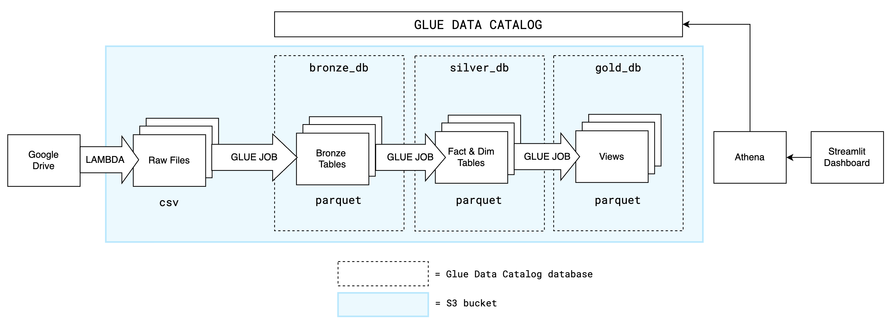
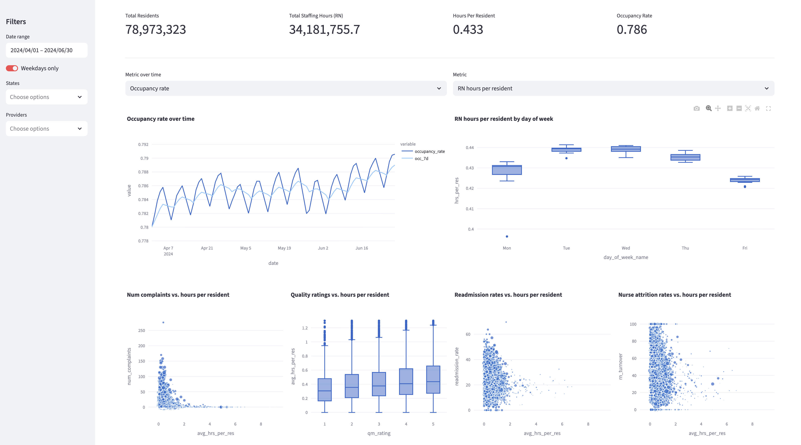

# NH Healthcare Metrics Pipeline

## Business goal

Build clean, analytics-ready datasets to study daily nurse staffing levels and how they relate to resident levels and quality scores across facilities.

Inputs:

* Facility details (attributes, resident load, etc.)  
* Daily staffing levels by facility (registered nurses, LPN, employed vs contract, etc.)  
* Medicare claims (quality measures, type of stay, etc.)

Outputs:

* `fct_staffing_levels` - grain: (provider_id, work_date)  
* `dim_dates` - grain: date (or date_key)
* `dim_providers` - grain: (provider_id)
* `dim_claims` - grain: (provider_id, measure_code)
* `daily_provider_metrics`, `agg_*` (gold) — gold tables/views used by dashboard

## Architecture



#### **Storage layout**

* Google Drive contains CSV data for each dataset  
* Top-level directories in S3 bucket:  
  * `raw:` landing area for raw CSV files; folder per dataset  
  * `bronze:` stores parquet files registered as external tables in Glue bronze database  
  * `silver:` parquet files registered as external tables in Glue silver database  
  * `gold:` parquet files registered as external tables in Glue gold database  
  * `state:` used by ingest lambda to track incremental extractions from Google Drive (startPageToken)  
* Glue Data Catalog stores the following schemas and objects  
  * `bronze:` raw tables tagged with metadata  
  * `silver:` fact & dimension tables  
  * `gold:` analytics tables/views for dashboard

#### Ingestion

* Lambda function `gdrive_to_s3` ingest raw CSVs from Google Drive  
  * Triggered via event notification for new files (or on scheduled runs)  
  * Authenticates to Google Drive via OAuth token stored in AWS Secrets Manager  
  * Incrementally extract files via Google Drive Changes API  
    * Stores startPageToken (checkpoint) in s3 subpath: `state/google-drive/startPageToken.json`  
  * Loads extracted CSV files into S3 raw landing zone

#### ETL Jobs

* Glue Job: Raw --> Bronze (external parquet tables)
  * `daily_staffing_raw`, `providers_raw`, `claims_raw`
* Glue Job: Bronze --> Silver (clean + typed + deduped)
  * `fct_staffing_levels` (partitioned by ingest_date)
  * `dim_providers`, `dim_claims`, `dim_dates` (overwritten)
* Gold layer: Athena CTAS (no Glue job)
  * `daily_provider_metrics`, `agg_daily_metrics`, `agg_provider_metrics`, `agg_state_metrics`
  * Built by executing SQL generated by `setup/create_gold_ctas.py` in Athena

## Pipeline Execution

1) (One-time setup) Create Glue tables (external Parquet tables)
   - Execute DDL generated by `setup/create_tables_athena.py` in Athena

2) Run ingestion + ETL (orchestrated via Step Functions - see Appendix below)
   - Lambda payload:
     - `full_refresh` (true/false): load all files from Drive folder (ignore `startPageToken`)
     - `persist_state` (true/false): write updated `startPageToken` checkpoint to S3
   - Glue job args:
     - `--PIPELINE_MODE` (`full` or `incremental`)
     - `--START_DATE` (`YYYY-MM-DD`, used when `--PIPELINE_MODE=incremental`)
     - `--SAMPLE` (true/false, bronze only; dev/testing)

3) Build gold tables
   - Execute SQL generated by `setup/create_gold_ctas.py` in Athena

#### **Consumption**

* Query tables via Athena through Glue Data Catalog  
* Connect Streamlit dashboard to Athena

## Dashboard
See rest of dashboard here: https://nh-healthcare.streamlit.app



## Project Files
```
├── dashboard
│   ├── app.py
├── docs
│   ├── healthcare-pipeline.md
├── ingest
│   ├── gdrive_to_s3.py
│   ├── lambda_function.py
│   ├── local_run.py
├── jobs
│   ├── config.py
│   ├── main_bronze.py
│   ├── main_silver.py
│   ├── run_bronze.py
│   └── run_silver.py
└── setup
    ├── create_gold_ctas.py
    ├── create_tables_athena.py
    ├── queries.py
    └── schemas.py
```
- `setup/create_tables_athena.py` generates DDL to run in Athena that creates schemas and external parquet tables in Glue Data Catalog 
- `ingest/*` defines the lambda function `gdrive_to_s3` that incrementally ingests from Google Drive to `/raw` directory in S3
- `jobs/*` defines the glue pyspark jobs to build the bronze, silver, gold layers of this pipeline
- `dashboard/app.py` builds the streamlit dashboard

## Appendix

### Example Step Functions JSON
```json
{
  "Comment": "Ingest Lambda -> Bronze Job -> Silver Job",
  "StartAt": "IngestLambda",
  "States": {
    "IngestLambda": {
      "Type": "Task",
      "Resource": "arn:aws:states:::lambda:invoke",
      "OutputPath": "$.Payload",
      "Parameters": {
        "FunctionName": "gdrive_to_s3",
        "Payload": {
          "full_refresh": false,
          "persist_state": true
        }
      },
      "Next": "BronzeJob"
    },
    "BronzeJob": {
      "Type": "Task",
      "Resource": "arn:aws:states:::glue:startJobRun.sync",
      "Parameters": {
        "JobName": "bronze-job",
        "Arguments": {
          "--JOB_NAME": "bronze-job",
          "--PIPELINE_MODE": "incremental",
          "--START_DATE": "2026-01-06",
          "--SAMPLE": "false"
        }
      },
      "Next": "SilverJob"
    },
    "SilverJob": {
      "Type": "Task",
      "Resource": "arn:aws:states:::glue:startJobRun.sync",
      "Parameters": {
        "JobName": "silver-job",
        "Arguments": {
          "--JOB_NAME": "silver-job",
          "--PIPELINE_MODE": "incremental",
          "--START_DATE": "2026-01-06"
        }
      },
      "End": true
    }
  },
  "TimeoutSeconds": 600
}
```